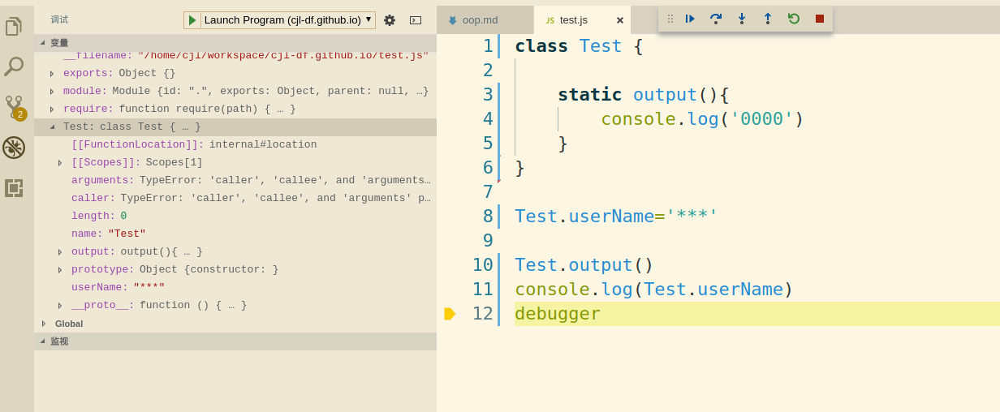
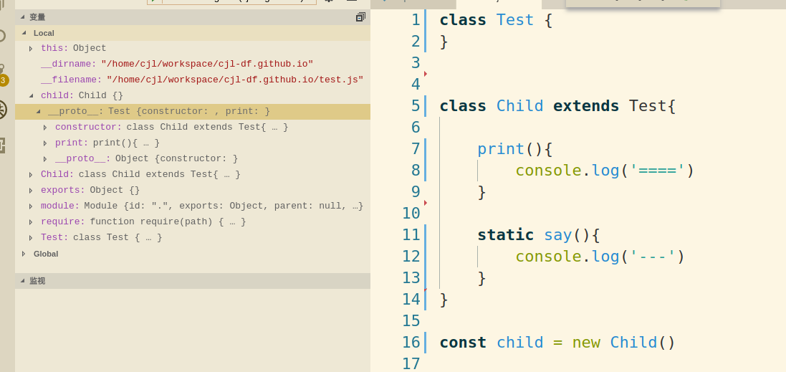

## javascript 面向对象编程，原型链及关键字class,extends，static解读

  * 原型链
    
    * __proto__属性
    
      * 1.在javascript语言中，除了基本数据类型，其余的都是对象，包括宿主环境，所有的对象都有__proto__属性；
      
      * 2.而__proto__指向的也是对象（继承过来的），一般为Object;Object的__proto__属性则指向null；
      
      * 3.__proto__就是我们说的原型对象；所谓原型链继承，也就是我们可以访问当前对象的__proto__指向的对象A(
        也就是当前对象的原型对象)，在通过A的__proto__,访问A的原型对象，直至object,再到
        object.__proto__指向的null
          
    * prototype属性
          
      * 1.javascript函数对象特有的属性，也就是我写一个函数，都会有一个prototype属性;该属性会有一个constructor
        属性，该属性指向我们创建的函数
        
      * 2.Function对象也有prototype属性和__proto__属性；__proto__属性指向Object,而prototype属性，则是
        我们创建的函数的__proto__指向的对象，也就是我们创建的函数（也是个对象）原型对象继承自Function.prototype
        属性。
      
      * 3.如果我们通过构造函数，来实例话一个对象，那么这个对象__proto__属性，就指向构造函数的prototype属性，
        这也是原型链实现的原理。
            
          
    * constructor 构造函数
    
      * 1.构造函数，也就是我们通过new调用的函数，通过new调用时，我们才称之为构造函数；
        通过new调用，特别指出就是它返回，函数中定一的this对象，该对象的__proto__指向构造函数的prototype；
        该对象的属性，自然也就是构造函数中this中定义的，因为this就是该对象。
      
      * 2.函数不通过new调用，就喝普通函数一样，默认返回undefined。
      
      * 3.我们手写实现new：

        ```
        function objectFactory() {
          var obj = new Object();

          const constructor = [].shift.call(arguments);

          obj.__proto__ = constructor.prototype;

          let entry = constructor.apply(obj, arguments);

          return typeof entry === 'object' ? entry : obj;
        }
        ```
          
         
  * class
      
    * class中定义的属性除了static修饰的以外，均为类的prototype的属性，包括constructor

    * new 实例的属性，constructor中通过this定义的属性

    * static修饰的属性为类的属性,(es7才可以定义属性，ES6可以定义静态方法)，也就是直接通过类名进行调用

      ```
      class Test {

          static output(){
              console.log('0000')
          }
      }

      Test.userName='***'

      Test.output()
      console.log(Test.userName)
      debugger
      ```

      

    * __proto__属性默认为Funciton对象的实例
  
  * extends 继承

    * 子类的prototype对象属性自然是自己类中定义的非static属性，而prototype对象的__proto__则是父类对象的实例；子类的__proto__属性则是父类

    * 通过上面的我们可以自然的得出下面的结论：

      * static 子类可以继承，并且只能用类直接调用

        ```
        class Test {

          static outPut(){
              console.log('ttt')
          }
        }

        Test.username='cjl'

        class Child extends Test{

            print(){
                console.log('====')
            }
        }

        const child = new Child()

        console.log(Child.username)
        Child.outPut()
        ```
      * 子类实例的原型链继承属性__proto__都是自己的实例，而自己的实例来源以自己的prototype对象；portotype属性的__proto__则是父类对象的实例，所以这儿的原型链继承是通过实例继承

          
  
    * super,this注意

      * super只有在派生类中使用，而this只能在调用super()后才能使用，因为super负责初始化this

        ```
        class Child extends Test{

          constructor(){
              //super类似let this = {},Test.call(this) return this
              // 所以如果不掉用super，不能调用this
              super()  
              this.usernmae= 'hello'
          }
        }
        ```